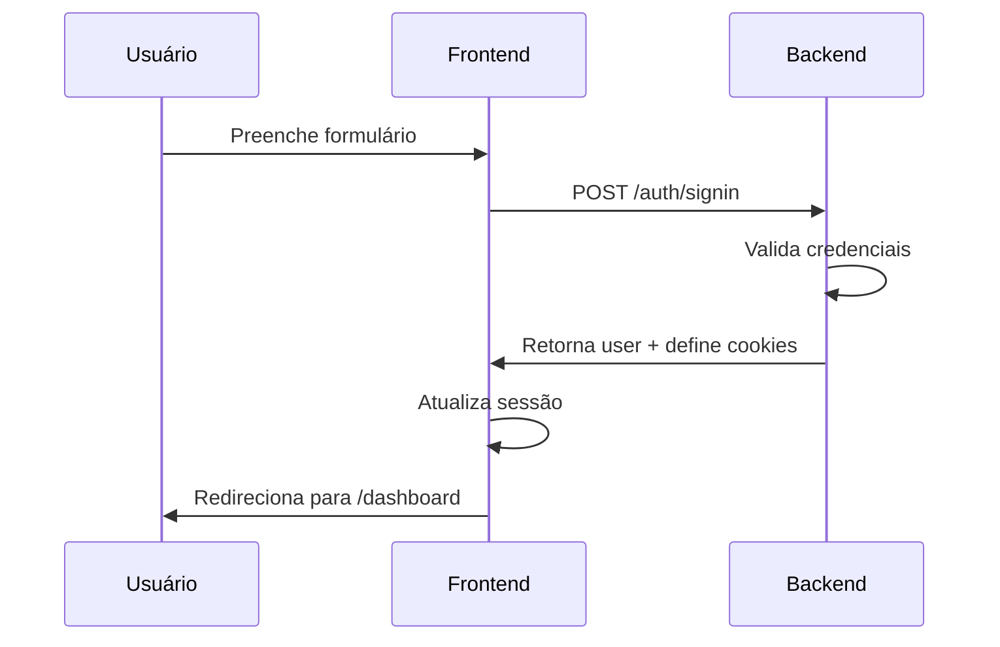
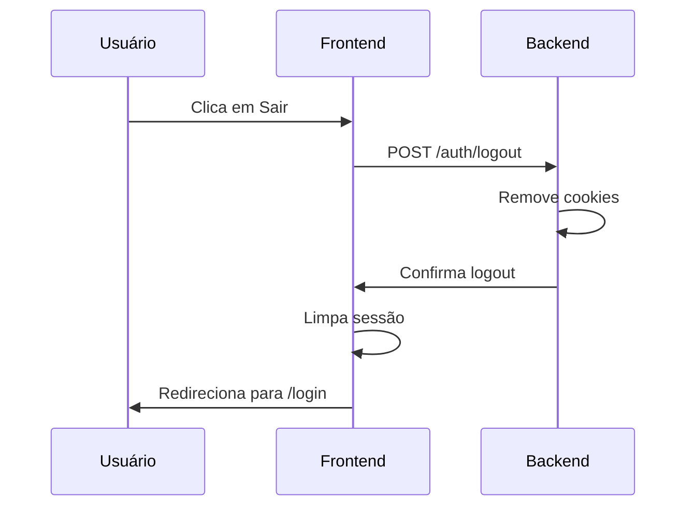
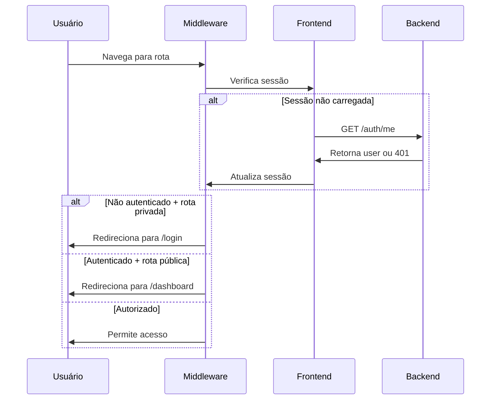

# Documentação de Autenticação

## Visão Geral

Esta aplicação Nuxt.js implementa um sistema de autenticação completo integrado com um backend Java que utiliza **cookies HTTP-Only** para gerenciar tokens JWT. A implementação é compatível com SSR (Server-Side Rendering) e CSR (Client-Side Rendering).

## Características Principais

- ✅ Autenticação baseada em cookies HTTP-Only seguros
- ✅ Tokens JWT (Access Token e Refresh Token) gerenciados pelo backend
- ✅ Não armazena tokens manualmente no frontend
- ✅ Todas as requisições usam `credentials: 'include'`
- ✅ Middleware global para proteção de rotas
- ✅ Compatível com SSR e CSR
- ✅ Gestão reativa de sessão do usuário
- ✅ Suporte a roles e permissões

## Arquitetura

### Backend (Java)

O backend gerencia completamente os tokens JWT através de cookies HTTP-Only:

- **Access Token**: Token de curta duração para autenticação
- **Refresh Token**: Token de longa duração para renovação
- Ambos são enviados como cookies HTTP-Only e Secure

**Endpoints disponíveis:**
- `POST /auth/signin` - Login
- `POST /auth/register` - Registro
- `POST /auth/logout` - Logout
- `POST /auth/refresh` - Renovar tokens
- `GET /auth/me` - Obter usuário autenticado

### Frontend (Nuxt.js)

O frontend nunca manipula os tokens diretamente. Toda a segurança é gerenciada pelos cookies HTTP-Only.

## Estrutura de Arquivos

```
app/
├── types/
│   └── auth.ts                 # Tipos TypeScript para autenticação
├── composables/
│   ├── useUserSession.ts       # Gerenciamento de sessão do usuário
│   └── useAuth.ts              # Operações de autenticação
├── middleware/
│   └── auth.global.ts          # Middleware global de autenticação
├── plugins/
│   └── auth.client.ts          # Plugin de inicialização da sessão
└── pages/
    ├── index.vue               # Página inicial
    ├── login.vue               # Página de login
    ├── register.vue            # Página de registro
    └── dashboard.vue           # Página protegida (exemplo)
```

## Componentes Principais

### 1. Types (`app/types/auth.ts`)

Define as interfaces TypeScript para autenticação:

```typescript
interface User {
  id: string
  name: string
  email: string
  cpf?: string
  phone?: string
  roles: string[]
  active?: boolean
}

interface UserSession {
  user: User | null
  loading: boolean
  loggedIn: boolean
}
```

### 2. useUserSession (`app/composables/useUserSession.ts`)

Composable para gerenciar o estado da sessão do usuário:

**Funcionalidades:**
- `session`: Estado reativo da sessão
- `user`: Usuário autenticado
- `loggedIn`: Status de autenticação
- `loading`: Status de carregamento
- `fetchUser()`: Busca dados do usuário via `/auth/me`
- `setUser(user)`: Atualiza o usuário na sessão
- `loadUser()`: Carrega o usuário autenticado
- `clearUser()`: Limpa a sessão
- `hasRole(role)`: Verifica se o usuário tem uma role específica
- `hasAnyRole(roles)`: Verifica se o usuário tem qualquer uma das roles

**Exemplo de uso:**

```vue
<script setup>
const { user, loggedIn, loading, hasRole } = useUserSession()
</script>

<template>
  <div v-if="loading">Carregando...</div>
  <div v-else-if="loggedIn">
    <p>Bem-vindo, {{ user.name }}!</p>
    <p v-if="hasRole('ADMIN')">Você é um administrador</p>
  </div>
  <div v-else>
    <p>Você não está autenticado</p>
  </div>
</template>
```

### 3. useAuth (`app/composables/useAuth.ts`)

Composable para operações de autenticação:

**Funcionalidades:**
- `signIn(credentials)`: Realiza login
- `signUp(userData)`: Cria nova conta
- `logout()`: Realiza logout
- `refreshToken()`: Renova o access token
- `checkAuth()`: Verifica autenticação
- `isLoggingIn`: Status de loading do login
- `isLoggingOut`: Status de loading do logout
- `isRegistering`: Status de loading do registro

**Exemplo de uso:**

```vue
<script setup>
const { signIn, isLoggingIn } = useAuth()
const form = ref({ email: '', password: '' })
const error = ref('')

const handleLogin = async () => {
  try {
    await signIn(form.value)
    // Redirecionamento automático para /dashboard
  } catch (err) {
    error.value = err.message
  }
}
</script>
```

### 4. Middleware Global (`app/middleware/auth.global.ts`)

Protege rotas privadas automaticamente:

**Rotas públicas:**
- `/` - Página inicial
- `/login` - Login
- `/register` - Registro

**Comportamento:**
- Usuários não autenticados são redirecionados para `/login`
- Usuários autenticados acessando `/login` ou `/register` são redirecionados para `/dashboard`
- A sessão é verificada a cada navegação

**Para adicionar rotas públicas:**

```typescript
const publicRoutes = ['/login', '/register', '/', '/about', '/contact']
```

### 5. Plugin de Inicialização (`app/plugins/auth.client.ts`)

Plugin client-side que inicializa a sessão ao carregar a aplicação:

- Executa automaticamente no carregamento
- Verifica se há cookies de autenticação válidos
- Carrega os dados do usuário se autenticado
- Falha silenciosamente se não houver sessão

## Fluxo de Autenticação

### Login



**Implementação:**

```typescript
const { signIn } = useAuth()

await signIn({
  email: 'usuario@email.com',
  password: 'senha123'
})
```

### Registro


**Implementação:**

```typescript
const { signUp } = useAuth()

await signUp({
  name: 'João Silva',
  email: 'joao@email.com',
  password: 'senha123',
  cpf: '123.456.789-00',
  phone: '(11) 98765-4321',
  roles: ['USER']
})
```

### Logout



**Implementação:**

```typescript
const { logout } = useAuth()

await logout()
```

### Verificação de Autenticação



## Configuração

### Runtime Config (`nuxt.config.ts`)

```typescript
export default defineNuxtConfig({
  runtimeConfig: {
    public: {
      apiBaseUrl: process.env.NUXT_PUBLIC_API_BASE_URL || 'http://localhost:8080'
    }
  }
})
```

### Variáveis de Ambiente

Crie um arquivo `.env` na raiz do projeto:

```env
NUXT_PUBLIC_API_BASE_URL=http://localhost:8080
```

Para produção:

```env
NUXT_PUBLIC_API_BASE_URL=https://api.seudominio.com
```

## Uso em Componentes

### Verificar Autenticação

```vue
<script setup>
const { loggedIn, user } = useUserSession()
</script>

<template>
  <div v-if="loggedIn">
    <p>Olá, {{ user.name }}!</p>
  </div>
  <div v-else>
    <NuxtLink to="/login">Faça login</NuxtLink>
  </div>
</template>
```

### Verificar Roles

```vue
<script setup>
const { hasRole, hasAnyRole } = useUserSession()
</script>

<template>
  <div>
    <p v-if="hasRole('ADMIN')">Painel de Administrador</p>
    <p v-if="hasAnyRole(['ADMIN', 'MANAGER'])">Painel de Gestão</p>
  </div>
</template>
```

### Proteger Rotas Específicas

Para adicionar proteção adicional a uma rota específica:

```vue
<script setup>
definePageMeta({
  middleware: ['auth']
})
</script>
```

Ou criar middleware customizado para verificar roles:

```typescript
// app/middleware/admin.ts
export default defineNuxtRouteMiddleware(() => {
  const { hasRole } = useUserSession()
  
  if (!hasRole('ADMIN')) {
    return navigateTo('/')
  }
})
```

```vue
<script setup>
definePageMeta({
  middleware: ['admin']
})
</script>
```

## Tratamento de Erros

### Erros de Autenticação

```typescript
const { signIn } = useAuth()
const error = ref('')

try {
  await signIn(credentials)
} catch (err) {
  if (err.status === 401) {
    error.value = 'E-mail ou senha inválidos'
  } else if (err.status === 403) {
    error.value = 'Usuário inativo'
  } else {
    error.value = 'Erro ao fazer login. Tente novamente.'
  }
}
```

### Renovação Automática de Token

O backend gerencia a renovação automática dos tokens. Se necessário, você pode forçar uma renovação:

```typescript
const { refreshToken } = useAuth()

try {
  await refreshToken()
} catch (error) {
  // Token expirado, usuário será redirecionado para login
}
```

## Segurança

### Cookies HTTP-Only

Os cookies HTTP-Only **não são acessíveis via JavaScript**, protegendo contra ataques XSS:

```javascript
// ❌ Isso NÃO funciona (e é proposital!)
document.cookie // Não consegue acessar os tokens
localStorage.getItem('token') // Não há tokens no localStorage
```

### HTTPS Obrigatório

Em produção, os cookies Secure só são transmitidos via HTTPS:

```
Set-Cookie: accessToken=...; HttpOnly; Secure; SameSite=Strict
Set-Cookie: refreshToken=...; HttpOnly; Secure; SameSite=Strict
```

### CORS

O backend deve estar configurado para aceitar requisições do frontend:

```java
// Configuração Java (exemplo)
@CrossOrigin(origins = "https://seuapp.com", allowCredentials = "true")
```

### Requisições ao Backend

**SEMPRE** use `credentials: 'include'`:

```typescript
await $fetch('/auth/me', {
  baseURL: config.public.apiBaseUrl,
  credentials: 'include' // ✅ Essencial!
})
```

## Troubleshooting

### "Não consigo fazer login"

1. Verifique se o backend está rodando em `http://localhost:8080`
2. Confirme que as credenciais estão corretas
3. Verifique o console do navegador para erros
4. Confirme que `credentials: 'include'` está sendo usado

### "Sessão não persiste após refresh"

1. Verifique se os cookies estão sendo definidos no navegador (DevTools > Application > Cookies)
2. Confirme que o plugin `auth.client.ts` está sendo carregado
3. Verifique se o endpoint `/auth/me` está retornando os dados corretos

### "Redirecionamento infinito"

1. Verifique as rotas públicas no middleware
2. Confirme que a rota atual está corretamente configurada
3. Verifique se há loops na lógica de redirecionamento

### "CORS Error"

1. Configure o backend para aceitar requisições do frontend
2. Use `allowCredentials: true` na configuração CORS
3. Configure os headers corretos no backend

## Exemplo Completo

### Página de Login Completa

```vue
<template>
  <div class="min-h-screen flex items-center justify-center">
    <UCard class="w-full max-w-md">
      <template #header>
        <h2 class="text-2xl font-bold">Login</h2>
      </template>

      <form @submit.prevent="handleSubmit" class="space-y-4">
        <div v-if="error" class="p-4 bg-red-50 text-red-800 rounded">
          {{ error }}
        </div>

        <UFormGroup label="E-mail" required>
          <UInput v-model="form.email" type="email" :disabled="isLoggingIn" />
        </UFormGroup>

        <UFormGroup label="Senha" required>
          <UInput v-model="form.password" type="password" :disabled="isLoggingIn" />
        </UFormGroup>

        <UButton type="submit" block :loading="isLoggingIn">
          Entrar
        </UButton>
      </form>
    </UCard>
  </div>
</template>

<script setup lang="ts">
definePageMeta({
  layout: false
})

const { signIn, isLoggingIn } = useAuth()

const form = ref({
  email: '',
  password: ''
})

const error = ref('')

const handleSubmit = async () => {
  error.value = ''
  
  try {
    await signIn(form.value)
  } catch (err: any) {
    error.value = err.message
  }
}
</script>
```

## Próximos Passos

1. **Adicionar "Esqueci minha senha"**: Implementar fluxo de recuperação de senha
2. **Two-Factor Authentication (2FA)**: Adicionar segunda camada de segurança
3. **Refresh Token Automático**: Implementar renovação automática antes da expiração
4. **Rate Limiting**: Adicionar proteção contra força bruta
5. **Auditoria**: Registrar tentativas de login e ações importantes

## Recursos Adicionais

- [Documentação Nuxt.js](https://nuxt.com/)
- [Nuxt UI](https://ui.nuxt.com/)
- [JWT.io](https://jwt.io/)
- [OWASP Authentication Cheat Sheet](https://cheatsheetseries.owasp.org/cheatsheets/Authentication_Cheat_Sheet.html)

## Suporte

Para dúvidas ou problemas, consulte:
- Documentação da API: `integracao-api.md`
- Issues do projeto no GitHub
- Equipe de desenvolvimento
