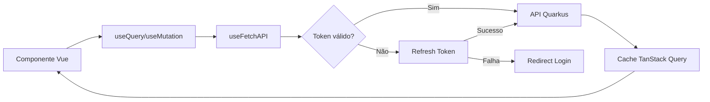

# Integração TanStack Query com Autenticação

Este documento descreve como usar o TanStack Query (vue-query) em conjunto com a autenticação do nuxt-auth-utils para fazer chamadas à API Quarkus.

## 📋 Índice

- [Visão Geral](#visão-geral)
- [Como Funciona](#como-funciona)
- [Uso Básico](#uso-básico)
- [Composables Disponíveis](#composables-disponíveis)
- [Exemplos Práticos](#exemplos-práticos)
- [Configuração Avançada](#configuração-avançada)
- [Boas Práticas](#boas-práticas)

## 🎯 Visão Geral

A integração entre TanStack Query e nuxt-auth-utils permite:

✅ **Autenticação Automática**: Todas as requisições incluem o token JWT automaticamente  
✅ **Refresh Automático**: Tokens expirados são renovados automaticamente  
✅ **Cache Inteligente**: Dados são armazenados em cache e reutilizados  
✅ **Gestão de Estado**: Loading, error e success states gerenciados automaticamente  
✅ **Type Safety**: Totalmente tipado com TypeScript  
✅ **Otimistic Updates**: Suporte para atualizações otimistas da UI

## 🔧 Como Funciona

### Fluxo de Autenticação



### Estrutura de Arquivos

```
app/
├── composables/
│   ├── useFetchAPI.ts      # Wrapper autenticado para fetch
│   ├── useAuth.ts          # Gerenciamento de autenticação
│   └── useUsers.ts         # Hooks de queries/mutations de usuários
└── plugins/
    └── vue-query.ts        # Configuração do QueryClient
```

## 🚀 Uso Básico

### 1. Fazendo uma Query (GET)

```vue
<script setup lang="ts">
import { useUsersQuery } from '~/composables/useUsers'

// Busca lista de usuários
const { data, isLoading, error, refetch } = useUsersQuery()
</script>

<template>
  <div>
    <!-- Loading state -->
    <div v-if="isLoading">Carregando usuários...</div>

    <!-- Error state -->
    <div v-else-if="error" class="error">Erro ao carregar: {{ error.message }}</div>

    <!-- Success state -->
    <div v-else-if="data">
      <div v-for="user in data" :key="user.id">{{ user.name }} - {{ user.email }}</div>
      <button @click="refetch()">Atualizar</button>
    </div>
  </div>
</template>
```

### 2. Fazendo uma Mutation (POST/PUT/DELETE)

```vue
<script setup lang="ts">
import { useCreateUserMutation } from '~/composables/useUsers'

const { mutate: createUser, isPending, error } = useCreateUserMutation()

const handleSubmit = formData => {
  createUser(formData, {
    onSuccess: user => {
      console.log('Usuário criado:', user)
      // A lista de usuários será automaticamente atualizada
      navigateTo(`/users/${user.id}`)
    },
    onError: error => {
      console.error('Erro:', error)
    }
  })
}
</script>

<template>
  <form @submit.prevent="handleSubmit">
    <!-- campos do formulário -->
    <button type="submit" :disabled="isPending">
      {{ isPending ? 'Salvando...' : 'Salvar' }}
    </button>
    <div v-if="error" class="error">{{ error.message }}</div>
  </form>
</template>
```

## 📦 Composables Disponíveis

### useFetchAPI

Fornece uma função `fetchAPI` configurada para incluir autenticação automaticamente.

```typescript
const { fetchAPI, fetchAPISafe } = useFetchAPI()

// Uso direto (não recomendado, use hooks específicos)
const users = await fetchAPI<User[]>('/users')

// Versão segura (não lança erro)
const { data, error } = await fetchAPISafe('/users')
```

### useUsers

Hooks pré-configurados para operações com usuários:

#### useUsersQuery()

Busca todos os usuários.

```typescript
const { data, isLoading, error, refetch } = useUsersQuery()
```

#### useUserQuery(userId)

Busca um usuário específico.

```typescript
const userId = ref('123')
const { data: user, isLoading } = useUserQuery(userId)
```

#### useCreateUserMutation()

Cria um novo usuário.

```typescript
const { mutate, isPending, error } = useCreateUserMutation()

mutate({ name: 'João', email: 'joao@example.com' }, { onSuccess: user => console.log(user) })
```

#### useUpdateUserMutation()

Atualiza um usuário existente.

```typescript
const { mutate: updateUser, isPending } = useUpdateUserMutation()

updateUser({ id: '123', name: 'João Silva' }, { onSuccess: () => console.log('Atualizado!') })
```

#### useDeleteUserMutation()

Deleta um usuário.

```typescript
const { mutate: deleteUser, isPending } = useDeleteUserMutation()

deleteUser('123', {
  onSuccess: () => console.log('Deletado!')
})
```

#### usePaginatedUsersQuery(options)

Busca usuários com paginação.

```typescript
const page = ref(0)
const size = ref(10)

const { data, isLoading } = usePaginatedUsersQuery({ page, size })

// Dados retornados:
// {
//   content: User[],
//   totalElements: number,
//   totalPages: number,
//   number: number,
//   size: number
// }
```

## 💡 Exemplos Práticos

### Exemplo 1: Lista com Busca e Paginação

```vue
<script setup lang="ts">
const page = ref(0)
const size = ref(10)
const search = ref('')

// Query reativa - refetch automático quando page/size/search mudam
const { data, isLoading, error } = usePaginatedUsersQuery({
  page,
  size,
  sort: computed(() => (search.value ? `name:${search.value}` : undefined))
})

const nextPage = () => {
  if (data.value && page.value < data.value.totalPages - 1) {
    page.value++
  }
}

const prevPage = () => {
  if (page.value > 0) {
    page.value--
  }
}
</script>

<template>
  <div>
    <input v-model="search" placeholder="Buscar usuários..." />

    <div v-if="isLoading">Carregando...</div>
    <div v-else-if="error">Erro: {{ error.message }}</div>
    <div v-else-if="data">
      <div v-for="user in data.content" :key="user.id">
        {{ user.name }}
      </div>

      <div class="pagination">
        <button @click="prevPage" :disabled="page === 0">Anterior</button>
        <span>Página {{ page + 1 }} de {{ data.totalPages }}</span>
        <button @click="nextPage" :disabled="page >= data.totalPages - 1">Próxima</button>
      </div>
    </div>
  </div>
</template>
```

### Exemplo 2: Formulário de Criação com Validação

```vue
<script setup lang="ts">
import { z } from 'zod'

const { mutate: createUser, isPending, error } = useCreateUserMutation()

const formSchema = z.object({
  name: z.string().min(3, 'Mínimo 3 caracteres'),
  email: z.string().email('Email inválido'),
  cpf: z.string().length(14, 'CPF inválido')
})

const form = reactive({
  name: '',
  email: '',
  cpf: ''
})

const validationErrors = ref<Record<string, string>>({})

const handleSubmit = () => {
  // Validação
  const result = formSchema.safeParse(form)

  if (!result.success) {
    validationErrors.value = result.error.flatten().fieldErrors
    return
  }

  // Mutation
  createUser(form, {
    onSuccess: user => {
      console.log('Usuário criado:', user)
      navigateTo(`/users/${user.id}`)
    }
  })
}
</script>

<template>
  <form @submit.prevent="handleSubmit">
    <div>
      <label>Nome</label>
      <input v-model="form.name" />
      <span v-if="validationErrors.name" class="error">
        {{ validationErrors.name }}
      </span>
    </div>

    <div>
      <label>Email</label>
      <input v-model="form.email" type="email" />
      <span v-if="validationErrors.email" class="error">
        {{ validationErrors.email }}
      </span>
    </div>

    <div>
      <label>CPF</label>
      <input v-model="form.cpf" />
      <span v-if="validationErrors.cpf" class="error">
        {{ validationErrors.cpf }}
      </span>
    </div>

    <button type="submit" :disabled="isPending">
      {{ isPending ? 'Salvando...' : 'Criar Usuário' }}
    </button>

    <div v-if="error" class="error">Erro ao criar: {{ error.message }}</div>
  </form>
</template>
```

### Exemplo 3: Atualização Otimista

```vue
<script setup lang="ts">
const queryClient = useQueryClient()
const { mutate: updateUser } = useUpdateUserMutation()

const handleToggleActive = (userId: string, currentActive: boolean) => {
  const newActive = !currentActive

  // Atualização otimista: UI atualiza imediatamente
  updateUser(
    { id: userId, active: newActive },
    {
      // Antes da mutation: atualiza o cache localmente
      onMutate: async variables => {
        // Cancela queries em andamento
        await queryClient.cancelQueries({ queryKey: ['users', userId] })

        // Snapshot do estado anterior
        const previousUser = queryClient.getQueryData(['users', userId])

        // Atualiza otimisticamente
        queryClient.setQueryData(['users', userId], (old: any) => ({
          ...old,
          active: newActive
        }))

        // Retorna contexto com o snapshot
        return { previousUser }
      },

      // Se der erro: reverte para o estado anterior
      onError: (err, variables, context) => {
        if (context?.previousUser) {
          queryClient.setQueryData(['users', userId], context.previousUser)
        }
      },

      // Sempre: revalida após sucesso ou erro
      onSettled: () => {
        queryClient.invalidateQueries({ queryKey: ['users'] })
      }
    }
  )
}
</script>
```

### Exemplo 4: Query Customizada

```typescript
// app/composables/useCompanies.ts
import { useQuery } from '@tanstack/vue-query'

export const useCompaniesQuery = (filters: { status?: MaybeRefOrGetter<string>; city?: MaybeRefOrGetter<string> }) => {
  const { fetchAPI } = useFetchAPI()

  return useQuery({
    queryKey: ['companies', filters],
    queryFn: async () => {
      const status = toValue(filters.status)
      const city = toValue(filters.city)

      const params = new URLSearchParams()
      if (status) params.set('status', status)
      if (city) params.set('city', city)

      return fetchAPI<Company[]>(`/companies?${params}`)
    },
    // Só executa se pelo menos um filtro estiver definido
    enabled: () => !!toValue(filters.status) || !!toValue(filters.city),
    staleTime: 1000 * 60 * 10 // 10 minutos
  })
}
```

## ⚙️ Configuração Avançada

### Configurações do Plugin (vue-query.ts)

O plugin já está configurado com valores sensatos:

```typescript
{
  queries: {
    staleTime: 1000 * 60 * 5,        // 5 minutos
    gcTime: 1000 * 60 * 60 * 24,     // 24 horas
    refetchOnWindowFocus: false,
    refetchOnReconnect: false,
    retry: (failureCount, error) => {
      // Não retry em erros de autenticação
      if (error?.response?.status === 401) return false
      if (error?.response?.status === 403) return false
      // Não retry em erros de validação
      if (error?.response?.status === 400) return false
      if (error?.response?.status === 422) return false
      // Retry até 2 vezes para outros erros
      return failureCount < 2
    },
    retryDelay: attemptIndex => Math.min(1000 * 2 ** attemptIndex, 30000)
  },
  mutations: {
    retry: false
  }
}
```

### Configurações por Query

Você pode sobrescrever as configurações globais:

```typescript
const { data } = useQuery({
  queryKey: ['critical-data'],
  queryFn: fetchData,
  staleTime: 0, // Sempre considera stale
  gcTime: Infinity, // Nunca remove do cache
  refetchOnWindowFocus: true, // Refetch ao focar janela
  retry: 3, // 3 tentativas
  retryDelay: 1000 // 1 segundo entre tentativas
})
```

## 🎯 Boas Práticas

### 1. Estruture Query Keys Hierarquicamente

```typescript
// ❌ Evite
queryKey: ['userList']
queryKey: ['userData']

// ✅ Prefira
queryKey: ['users'] // Lista de todos os usuários
queryKey: ['users', userId] // Usuário específico
queryKey: ['users', userId, 'posts'] // Posts de um usuário
```

### 2. Use MaybeRefOrGetter para Parâmetros Dinâmicos

```typescript
// ✅ Aceita ref, computed ou valor direto
export const useUserQuery = (userId: MaybeRefOrGetter<string>) => {
  return useQuery({
    queryKey: ['users', userId],
    queryFn: () => fetchAPI(`/users/${toValue(userId)}`)
  })
}

// Uso flexível
const userId = ref('123')
const { data } = useUserQuery(userId) // ref

const userId2 = computed(() => route.params.id)
const { data } = useUserQuery(userId2) // computed

const { data } = useUserQuery('456') // valor direto
```

### 3. Sempre Invalide Queries Relacionadas

```typescript
const { mutate: createUser } = useMutation({
  mutationFn: data => fetchAPI('/users', { method: 'POST', body: data }),
  onSuccess: newUser => {
    // Invalida todas as queries de usuários
    queryClient.invalidateQueries({ queryKey: ['users'] })

    // Adiciona o novo usuário ao cache
    queryClient.setQueryData(['users', newUser.id], newUser)
  }
})
```

### 4. Use `enabled` para Queries Condicionais

```typescript
// ✅ Só busca se userId existir
const { data } = useQuery({
  queryKey: ['users', userId],
  queryFn: () => fetchAPI(`/users/${toValue(userId)}`),
  enabled: () => !!toValue(userId)
})
```

### 5. Trate Erros Adequadamente

```typescript
const { data, error, isError } = useUsersQuery()

watchEffect(() => {
  if (isError.value) {
    // Log do erro
    console.error('Erro ao buscar usuários:', error.value)

    // Notificação ao usuário (toast, etc)
    showToast('Erro ao carregar usuários', 'error')

    // Tracking de erro (Sentry, etc)
    captureException(error.value)
  }
})
```

### 6. Use Suspense para Loading States Declarativos

```vue
<template>
  <Suspense>
    <template #default>
      <UserList />
    </template>
    <template #fallback>
      <div>Carregando usuários...</div>
    </template>
  </Suspense>
</template>

<script setup lang="ts">
// UserList.vue
const { data, suspense } = useUsersQuery()
await suspense() // Espera a query resolver
</script>
```

### 7. Prefetch para Melhor UX

```typescript
const router = useRouter()
const queryClient = useQueryClient()

// Prefetch ao hover
const handleMouseEnter = (userId: string) => {
  queryClient.prefetchQuery({
    queryKey: ['users', userId],
    queryFn: () => fetchAPI(`/users/${userId}`)
  })
}

// Prefetch antes de navegar
router.beforeEach(async to => {
  if (to.name === 'users-id') {
    await queryClient.prefetchQuery({
      queryKey: ['users', to.params.id],
      queryFn: () => fetchAPI(`/users/${to.params.id}`)
    })
  }
})
```

## 🔍 Debugging

### Vue Devtools

O TanStack Query está integrado ao Vue Devtools. Você pode inspecionar:

- Todas as queries ativas
- Status de cada query (fresh, stale, fetching)
- Dados em cache
- Histórico de fetches

### Logs Manuais

```typescript
const queryClient = useQueryClient()

// Ver todas as queries em cache
console.log(queryClient.getQueryCache().getAll())

// Ver dados de uma query específica
console.log(queryClient.getQueryData(['users']))

// Ver estado de uma query
console.log(queryClient.getQueryState(['users']))
```

## 🚨 Troubleshooting

### Token não encontrado

**Erro**: `Token de acesso não encontrado`

**Solução**: Verifique se o usuário está autenticado antes de fazer queries:

```typescript
const { loggedIn } = useUserSession()

const { data } = useQuery({
  queryKey: ['users'],
  queryFn: fetchUsers,
  enabled: loggedIn // Só executa se estiver logado
})
```

### Query não atualiza após mutation

**Problema**: Dados não são atualizados após criar/editar/deletar

**Solução**: Certifique-se de invalidar as queries relacionadas:

```typescript
onSuccess: () => {
  queryClient.invalidateQueries({ queryKey: ['users'] })
}
```

### Múltiplos fetches desnecessários

**Problema**: Mesma query é executada múltiplas vezes

**Solução**: Aumente o `staleTime`:

```typescript
const { data } = useQuery({
  queryKey: ['users'],
  queryFn: fetchUsers,
  staleTime: 1000 * 60 * 5 // 5 minutos
})
```

---

## 📚 Recursos Adicionais

- [TanStack Query Docs](https://tanstack.com/query/latest/docs/framework/vue/overview)
- [Nuxt Auth Utils](https://github.com/atinux/nuxt-auth-utils)
- [Vue Query Best Practices](https://tanstack.com/query/latest/docs/framework/vue/guides/best-practices)
